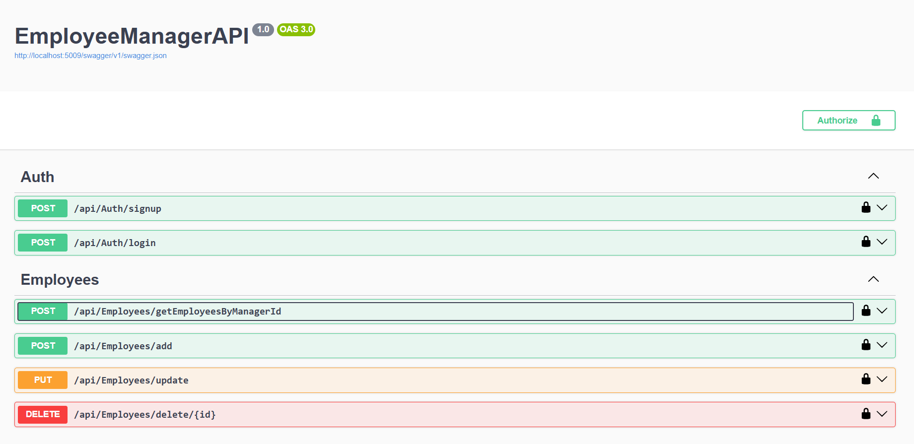
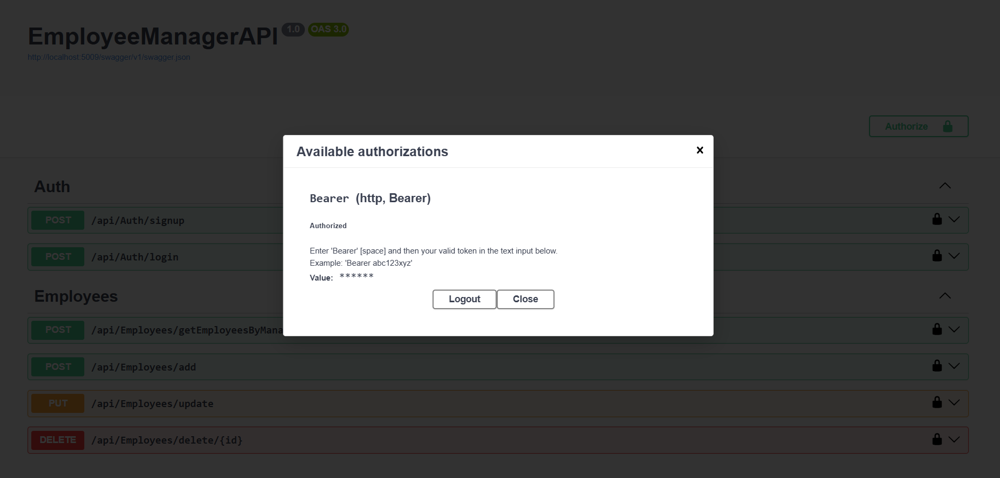
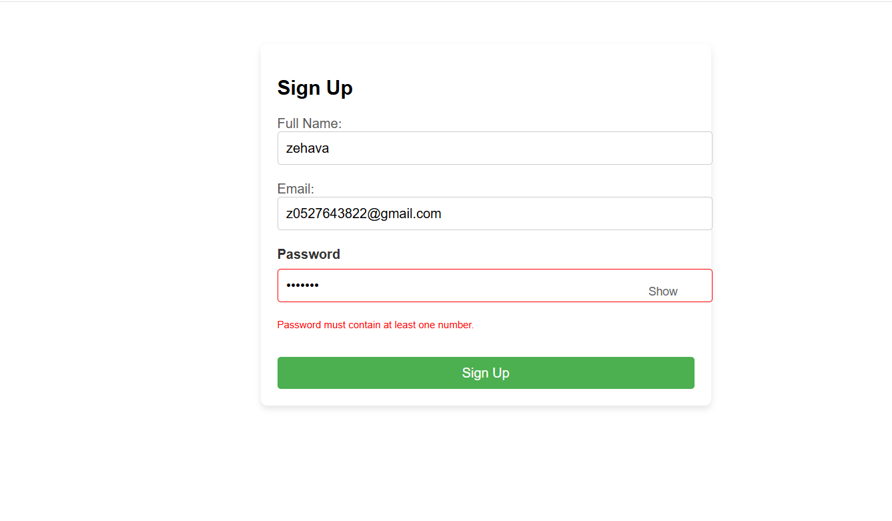
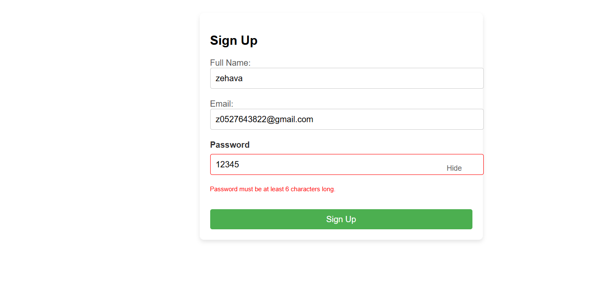
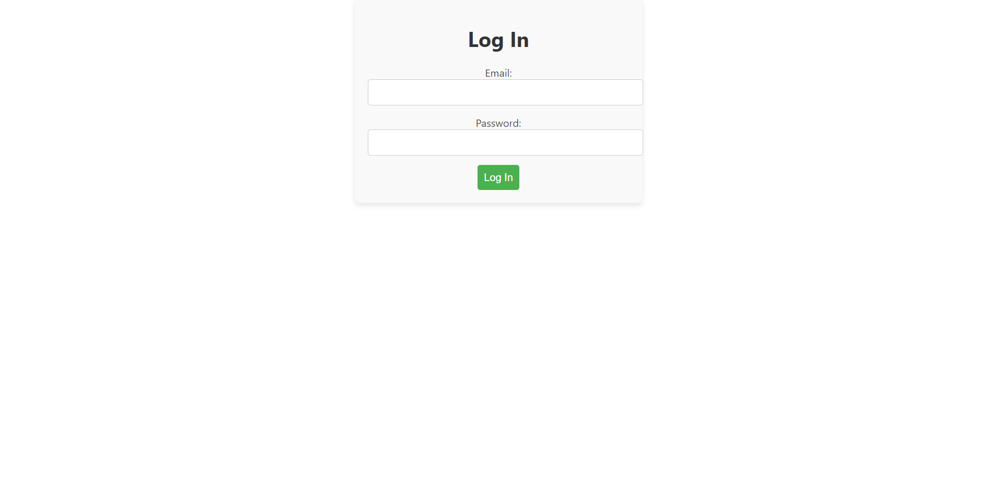
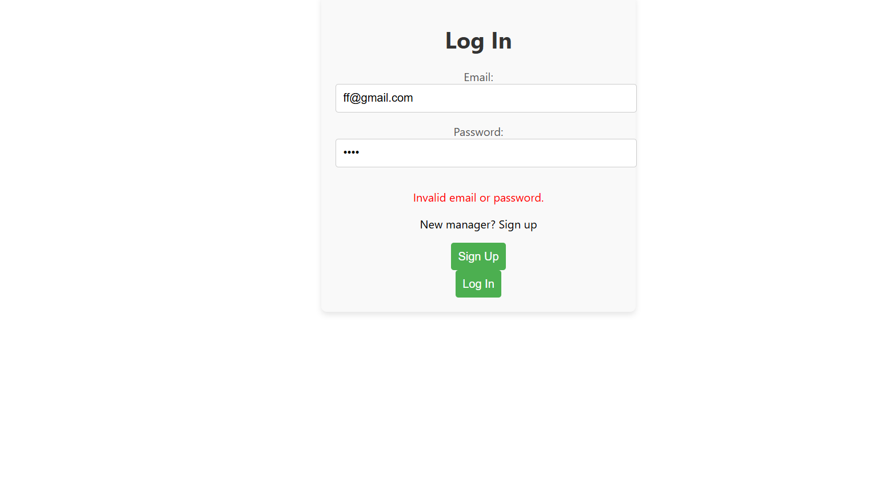
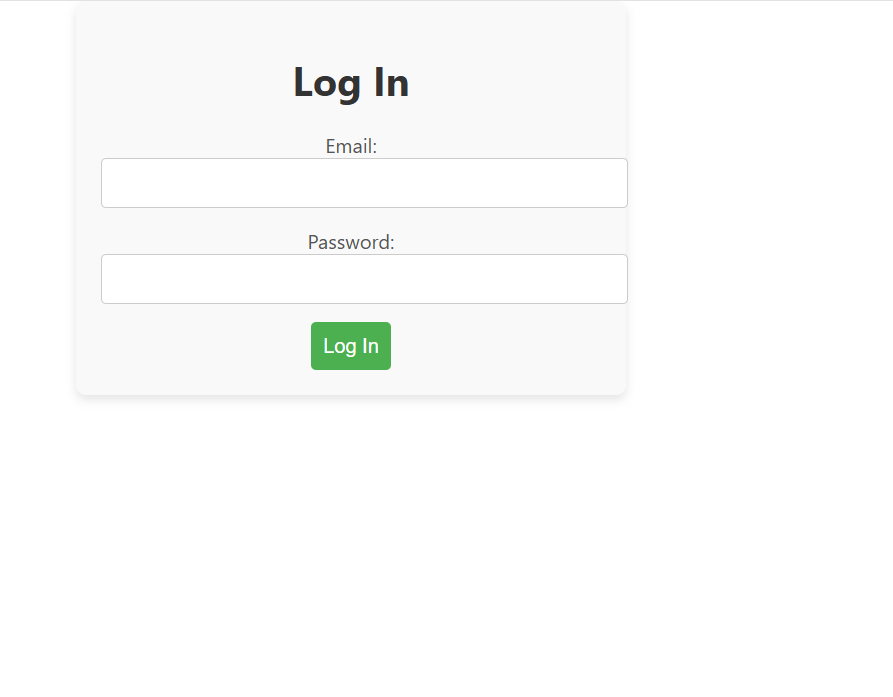
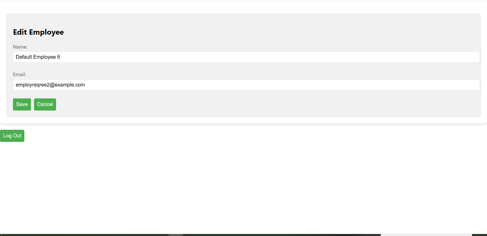

# Employee Manager Application

This is a full-stack Employee Manager application built using **.NET 8** for the backend API, **SQLite** for db, and **React** for the frontend.  The application allows managers to register, login, and manage their employees.
I use entity framwork - Entity Framework is a great choice for most .NET applications that interact with relational databases. It provides a high-level, developer-friendly API for managing data, reducing complexity, and boosting productivity. 

## Screenshot of system










## Requirements

Before running the application, ensure that you have the following installed on your system:

- **.NET SDK 8** (or the version you are using)
  - [Download .NET SDK](https://dotnet.microsoft.com/download)
- **Node.js** and **npm** (for the React frontend)
  - [Download Node.js](https://nodejs.org/)
- **SQLite** or **SQL Server** for the database (you can use SQLite for simplicity)
  - [Download SQLite](https://www.sqlite.org/download.html) (if using SQLite)
- **Visual Studio Code** (or any preferred code editor)
  - [Download Visual Studio Code](https://code.visualstudio.com/)

## Setting Up the Backend API (Server-side)

1. **Clone the repository:**

   ```bash
   git clone https://github.com/Zehavas-NBS/Clalit-Home
   cd ProjectHome
   ```

2. **Navigate to the `Server` folder:**

   ```bash
   cd backend
   ```

3. **Restore dependencies:**

   To restore the required packages for the backend API, run:

   ```bash
   dotnet restore
   ```


5. **Run the Migrations:**

   ```bash
   dotnet ef database update
   ```

   This will generate the database schema based on your `DbContext`.

6. **Run the Backend API:**

   Start the backend API server using:

   ```bash
   dotnet run
   ```

   The application should be running on [http://localhost:5009](http://localhost:5009).

## Setting Up the Frontend (Client-side)

1. **Navigate to the `Client` folder:**

   ```bash
   cd frontend
   ```

2. **Install dependencies:**

   To install the necessary packages for the React frontend, run:

   ```bash
   npm install
   ```

3. **Run the Frontend:**

   Start the frontend application using:

   ```bash
   npm start
   ```

   This will run the frontend on [http://localhost:3001](http://localhost:3001).

## Running the Application

Once both the backend API and frontend are running:

- **Backend (API)**: [http://localhost:5009](http://localhost:5009) (default for ASP.NET Core).
- **Frontend (React app)**: [http://localhost:3001](http://localhost:3001).
- **Swagger**: [http://localhost:5009/swagger/index.html](http://localhost:5009/swagger/index.html).
  - in swagger you can send the token that you got from login response and put it in "Authorize" button for all the next request..

### Test the API

You can test the API endpoints using tools like **Postman** or **cURL**. Below are the common API endpoints:

- `POST /api/auth/signup`: Register a new manager.
  - Request body: `{ "email": "manager@example.com", "password": "YourPassword123", "fullName": "John Doe" }`
- `POST /api/auth/login`: Log in and obtain a JWT token.
  - Request body: `{ "email": "manager@example.com", "password": "YourPassword123" }`
- `GET /api/Employees/getEmployeesByManagerId`: Get employees for the currently logged-in manager (requires JWT).
- `POST /api/Employees/add`: Add employee for the currently logged-in manager(requires JWT).
  - Request body: `{ "email": "manager@example.com", "password": "YourPassword123" , "fullName": "Cohen"}`
- `PUT /api/Employees/update`: Update employee for the currently logged-in manager(requires JWT).
  - Request body: `{ "email": "manager@example.com", "password": "YourPassword123" , "fullName": "Cohen"}`
- `Delete /api/Employees/delete/{id}`: Delete employee by id for the currently logged-in manager(requires JWT).

### Example API Request Using cURL (Login)

```bash
curl -X POST "http://localhost:5009/api/auth/login" -H "Content-Type: application/json" -d '{"email":"manager@example.com","password":"YourPassword123"}'
```

This will return a JWT token, which can be used for further authenticated API requests (e.g., fetching employees).

### Example API Request Using cURL (Fetch Employees)

```bash
curl -X GET "http://localhost:5009/api/Employees/getEmployeesByManagerId" -H "Authorization: Bearer YOUR_JWT_TOKEN"
```

---

## Project Structure

The project consists of two main parts:

- **Server (Backend)**
  - Handles API requests and database operations.
  - Located in the `backend` directory.
- **Client (Frontend)**
  - Built with React and communicates with the API.
  - Located in the `frontend` directory.

---

## Additional Features

- **Authentication with JWT**: Used for secure login and access control.
- **CRUD operations**: Managers can add, update, view, and delete employees.
- **Log4net**: Log every request.
- **Swagger**
- **Material UI**: Used to increase options in React 
---

- **JWT Authentication**: Ensure you are sending the JWT token in the `Authorization` header for endpoints that require authentication, also you can send it by swagger "Authorize" button